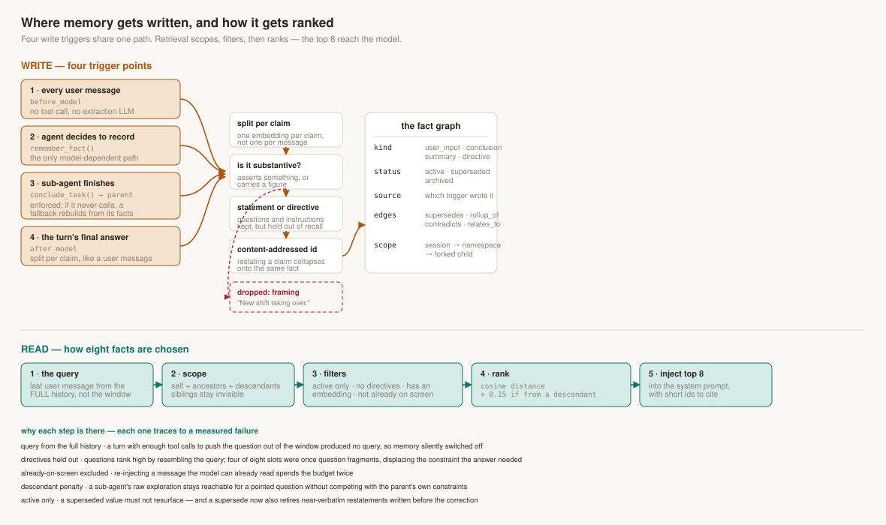

# Building a Fact-Driven Memory Layer for LangGraph

*Part 1 in a series.*

## The idea

LangGraph gives you two memory primitives. A checkpointer holds message history inside one thread. `BaseStore` — `PostgresStore` with pgvector in practice, usually with LangMem on top — holds documents across threads: save a memory, embed it, cosine-search it back later.

That store has no vocabulary for the things a long-running agent actually needs to express:

- *This value replaced that one.* A user says the budget is $100k, then corrects it to $50k. Both documents now sit in the store, embedded 0.002 apart, and nothing marks which is current.
- *This claim came from that sub-agent.* Three researchers investigate three subsystems in parallel. Their findings land in one flat namespace, and nothing stops one researcher's exploration from crowding out another's conclusion.
- *This is a question, not a fact.* Questions rank highly against queries precisely because they resemble them.

The hypothesis was that these are not retrieval-quality problems to be tuned away, but missing *types*. A store that knows a `supersedes` edge from a `rollup_of` edge should be able to answer things a bag of embedded documents cannot — and it should do so with a smaller, more precise payload, because a claim is not a document.

This is a side project. The point was to find out whether that hypothesis survives contact with a benchmark.

Code and every run: [github.com/masterkidan/langgraph-beads-memory](https://github.com/masterkidan/langgraph-beads-memory).

## How memory should work

Start from what a session actually is. A user talks to an agent on Monday, comes back Thursday on a new thread, and expects it to remember. Sub-agents get spawned mid-task, do work, and disappear. Constraints get stated, then revised. None of that is a document-retrieval problem — it is a modelling problem, and the model has to name three things a `BaseStore` cannot.

**Scope.** Memory belongs to a *session*, not a thread and not a user. A thread is a conversation; a session is the work. The store should span threads without knowing what a "user" is — an application that wants a user↔session mapping owns that table.

**Currency.** Facts have a lifecycle. A value is stated, restated, and eventually replaced. "Which of these two is true now" has to be answerable from structure, because it is not answerable from similarity — `$100,000` and `$50,000` embed 0.002 apart, and cosine cannot tell them apart in either direction.

**Provenance.** Who produced this claim, and from what. A sub-agent's raw exploration and the supervisor's stated constraints should not compete on equal terms, and a conclusion should point at whatever was in context when it was formed.

## The data model



*Fig 1 — Scope, the anatomy of a fact, the four kinds, the status lifecycle, and the typed edges.*

Three tables: `namespaces`, `facts`, `fact_edges`. Postgres and pgvector, no graph database and no separate vector store.

**Namespaces** form a tree under one `session_id`. The root belongs to the supervisor; every forked sub-agent gets a child. Ids are *derived* — `uuid5(session_id, extra_path)` — so replaying the same conversation into an empty database reproduces the same ids. The one deliberately random element is the child suffix, because two concurrently spawned sub-agents must not collide.

Scope is asymmetric on purpose. A child reads itself plus its ancestors, **never** a sibling — that is what stops three parallel researchers contaminating each other. A parent additionally reads its whole subtree, with a rank penalty. Descendant visibility is a parent privilege, not a general relaxation.

**Facts** carry `kind`, `status`, `source`, `agent_id`, `acting_on_behalf_of`, a body, and two vectors. `kind` is one of `user_input`, `conclusion`, `summary`, `directive` — that last one being questions, instructions and stated goals, which are stored for provenance but held out of retrieval. Directives rank highly against a query precisely by resembling it; in one run four of eight injected slots were question fragments displacing the constraint the answer needed.

Fact ids are **content-addressed**: a hash of `(session_id, namespace_id, source, source_key, sha256(body))`. This matters more than it sounds. LangGraph replays checkpoints, so a capture hook can fire twice on the same message. Content addressing makes the second write a no-op rather than a duplicate — and it means an agent restating a conclusion it already reached collapses onto the same row instead of accumulating another copy.

**Edges** are `supersedes`, `derived_from`, `rollup_of`, `contradicts`, `relates_to`. Only `supersedes` changes what retrieval returns, and it is guarded: refused unless the two facts are semantically close, because an agent once retired a user's entire constraints message with *"The investigation into Weaviate has been completed."* A rule based on fact *kind* would not have caught that — the one legitimate revision had the identical shape — so the guard uses similarity instead.

Nothing is deleted. `superseded` and `archived` are lifecycle states, not tombstones, so "what did we believe before, and what replaced it?" stays answerable.

## Why split messages into claims

This is the decision everything else follows from, and it is a genuine trade rather than an obvious win.

A user message stating three constraints — *"the budget is $100k per year, it must be self-hostable, and I only trust primary benchmark data"* — can be stored as one row or three. Storing it as one costs two things, both measured:

**One embedding, averaged across every topic in the message.** A constraint stated inside a longer sentence never reaches the top-K for a question about it. In one run the root cause of an incident was captured nine times over, every copy active, and ranked 30th of ~90 — outside the top-8 injection in all three runs, while the baseline's un-split document ranked 7th of 10 and got used.

**One row, so invalidation is all-or-nothing.** A single bad `supersedes` edge retires every constraint sharing that row. Splitting is what makes `supersedes` surgical: correct the budget and the self-hosting requirement survives.

There is a third, less obvious cost. A 1,925-character fact is roughly 500 tokens; two or three in a top-8 consume most of the injection budget. Splitting agent answers per claim cut input tokens ~40%.

The price is real and shows up later in this piece: **splitting destroys co-occurrence.** `"25:50"` on its own has almost no surface for a query to match, where `"I got my 5K down to 25:50"` has plenty. A document store keeps that adjacency for free; a claim store throws it away and has to earn it back.

The partial compensation is a second vector. Every fact stores both its own embedding and the embedding of the text it was carved from, and ranking blends the two — so a claim from a relevant passage gets pulled up by its context even when the claim alone is thin.

Splitting is heuristic and verbatim: no LLM, no paraphrasing. Passive capture runs in the model-call hot path and cannot afford an extraction call, and the verbatim-record guarantee has to survive per fragment or the audit trail stops being an audit trail. The bias is toward under-splitting — a fragment that is merely long is harmless, while a fragment shredded into meaningless pieces pollutes retrieval permanently.

## The interface



*Fig 2 — Capture triggers converge on one path; retrieval scopes, filters, ranks and injects.*

It is **agent middleware**, not a `BaseStore` implementation and not a checkpointer replacement. That choice is the reason capture is reliable.

```python
agent = create_agent(
    model=llm,
    tools=[...],
    middleware=[BeadsMemoryMiddleware(
        store=store, namespace=ns, embedder=OllamaEmbedder(),
        agent_id="root", acting_on_behalf_of="user",
    )],
)
```

Four hooks do the work. `before_model` captures user messages. `wrap_tool_call` captures what non-memory tools return, into the *calling* agent's namespace. `after_model` captures the turn's final answer and links it to whatever was injected. `wrap_model_call` trims the window, runs retrieval, and writes the block into the system prompt.

The block lands in the **system prompt**, rewritten each call — not in the message history. That distinction is load-bearing for cost: a `search_memory` tool result is a message, so it is re-sent on every subsequent model call in the turn and accumulates. A system-prompt block is paid once and replaced.

Three tools are bound for the agent, and only one is available everywhere:

| tool | who gets it | what it does |
|---|---|---|
| `remember_fact` | every agent | record a conclusion, optionally citing a short id it supersedes or contradicts |
| `conclude_task` | forked sub-agents | required before returning; writes one summary into the parent with `rollup_of` edges back to the raw work |
| `recall_from_subagents` | orchestrators only | read what a named sub-agent recorded, past its one-line summary |

`recall_from_subagents` exists because demoted search is a *guess* — a child's fact surfaces only if the query happens to match it. An orchestrator usually knows something stronger: it delegated a topic to a named researcher. This lets it look rather than hope.

The critical property is that none of these is required. Capture happens on hooks, so durable memory never depends on the model choosing to call a tool — which matters because it frequently does not. On one benchmark the model called `remember_fact` for 6–8% of what ended up in the store.

## The measurement problem

Two scenarios shipped with the project: pick a vector database across three threads, debug a production incident across four. Both were built to exercise mechanisms the library has — a planted budget correction, a detail buried in one researcher's findings.

Which makes them nearly useless as evidence. A scenario written to demonstrate a mechanism will demonstrate it. The repo says so directly: *"This is a designed demonstration, not a neutral benchmark."*

So the real question became how to measure this honestly, and that turned out to be most of the work.

**LongMemEval** is the benchmark chosen, for three reasons. It is external and MIT-licensed, so nothing about it was shaped by this library. Both Zep/Graphiti and Mem0 publish results on it, so a number here means something outside this repo. And its `knowledge-update` category — 78 questions, each turning on a value the user states and later changes — targets exactly the mechanism the hypothesis is about. If typed invalidation is worth anything, it should be worth something there.

Model is `gemma4:12b` locally via Ollama; the judge is the same model, applied identically to every arm.

## The first result, and why it was wrong

Each arm retrieving what it would naturally retrieve:

| arm | correct | mean input tokens |
|---|---|---|
| whole transcript in the prompt | 64/78 (82%) | 6,337 |
| LangGraph `PostgresStore` over turns | 57/78 (73%) | 2,473 |
| fact graph | 48/78 (62%) | 328 |

Third of four. I nearly published that.

Then the third column. The store took **7.5× more context** than the fact graph. That table does not compare memory strategies — it compares budgets. An arm handed 2,473 tokens beats an arm handed 328 whatever fills them.

This is the default shape of most memory benchmarks. Each system retrieves its natural amount, whichever retrieves more wins on accuracy, and cost lands in a separate table or none at all. It reads as fair because both sides are doing retrieval.

There is a second flaw in it. The `fact graph` arm above sees *only* the retrieved facts — no conversation at all. Nobody deploys memory that way. The middleware sends the windowed raw messages **plus** an injected block; memory augments the transcript, it does not replace it.

## Measuring it properly

Fix the total context budget. Vary only how it is spent.

- **transcript only** — fill the budget with the most recent conversation
- **facts + transcript** — spend ~950 characters on retrieved facts, fill the remainder with transcript

Same reader, same questions, same token allowance, `num_ctx` fixed high enough that nothing is truncated by the window. The only variable is allocation.


*Fig 3 — Every arm as a point on (context spent, accuracy), n=78 per point.*

At a 1,200-token budget:

| at 1,200 tokens, n=78 | correct | % of ceiling | % of context |
|---|---|---|---|
| transcript only | 23/78 | 36% | 19% |
| LangGraph `PostgresStore` | 42/78 | 66% | 15% |
| **fact graph** | **51/78** | **80%** | 19% |

Four-fifths of what full attention achieves, on a fifth of the context. Clipping the window to a fifth costs 64% of the ceiling with raw transcript, and 20% with the fact graph on top.

Totals hide whether two arms solve the *same* questions:


*Fig 4 — The same 78 questions as win / both / neither / lose. Against the store at a matched budget: 22 won, 13 lost, 29 already shared.*

So the hypothesis holds — conditionally. Against LangGraph's store, at equal context, a typed fact graph is worth nine questions in seventy-eight.

## The condition

Sweeping the budget is where it gets interesting.


*Fig 5 — Identical token budget in both arms; only the split changes. n=78 at the ends, n=25 at 3,000.*

| budget | transcript only | facts + transcript | Δ |
|---|---|---|---|
| 1,200 tokens | 23/78 | **51/78** | **+28** |
| 3,000 tokens | 19/25 | 20/25 | +1 |
| 6,000 tokens | 66/78 | 65/78 | −1 |

Five questions won for every one lost at a tight budget. At 6,000 tokens the split is 4 to 5 — a coin flip — with 61 of 78 already shared.

Sample size matters at this end, and I got it wrong once: at n=25 the 6,000 point measures −2, which looks like active interference. At n=78 it is −1, which is a tie. Memory stops paying. It does not cost accuracy.

## Why the advantage decays

A model does not search its context. It attends to all of it, at every layer: each token emits a query vector, every prior token carries a key, the dot products pass through a softmax, and the output is a weighted blend of everything present. Dozens of heads do this in parallel and compose across depth.

`search()` makes one decision — embed the query, rank by cosine, take the top 8, commit — before the model has reasoned about anything.

Retrieval is a function of the context, so by the data processing inequality it cannot increase mutual information with the answer. Filtering can only lose. When the material fits in the window, an external retriever is strictly worse than passing everything through, and only the margin is in question.

Retrieval holds exactly one advantage, decisive where it applies: **attention cannot attend to tokens that were never admitted.** Truncation is the one thing it cannot route around. The job of a memory layer is not to retrieve better than attention — it is to decide what enters the window so attention has the right material.

That reframes the original hypothesis. Typed memory is not a better search engine. It is a better *gatekeeper*, and gatekeeping only matters when the gate is closed.

## What mattered in the implementation

**Deriving `supersedes` links rather than requesting them.** The agent had `remember_fact`, the held facts with their short ids in the prompt, and an explicit instruction to link contradictions. It proposed a link on **9 of 78** questions that were *all* about a value changing. Deriving the same links from a normalised value comparison found **43**. The model was not refusing — retrieval had never shown it the fact to supersede, which sat at rank 21 of ~180 while the top 8 were captured assistant prose.

**Resolution instead of retirement.** Excluding a superseded fact leaves the slot empty, which does not help an agent about to answer with the stale value. A hit on any version of a claim now resolves to the current one. The failure this fixes: answering "you currently have three bikes" when the user owns four.

**A `derived_from` filter.** Every captured conclusion links to the facts that were in context when it was written, so a restatement is dropped when the fact it came from is already in the block. Recorded provenance, not redundancy inferred from a vector.

**Tool results captured into the calling agent's namespace.** A sub-agent reads a TLS handshake p99 of 41ms and drops it when summarising. That figure passes 9 of 56 runs on the incident scenario, and no ranking change reaches it, because it was never written. Scoping capture to the caller keeps raw sub-agent reads out of the root's ranking.

## Practical notes

Mostly things worth knowing before building another one.

- Context budgets have to match across arms, or the benchmark measures budgets
- Cost and accuracy belong in the same row; separated, a cheaper-and-slightly-worse arm reads as a loss
- Pairwise win/lose belongs alongside totals — two arms can tie while solving different questions
- A retrieval-only gate is worth having early. Scoring "does the gold answer reach the injected block" needs no generation and runs in minutes
- `num_ctx` has to be set explicitly. Ollama defaults to 2048 and truncates silently: prompts of 5k, 22k and 135k tokens all report `prompt_eval_count=2051`, so token accounting goes wrong with no error
- Graph structure is better derived from values and provenance than requested from the model
- Structural changes that look obviously correct still need measuring. A supersedes-demotion rule produced byte-identical answers across all 78 questions

## What's next

Everything here runs on a ~6,900-token haystack, so scarcity was produced by capping the budget rather than by lengthening the conversation. That simulates a small-context model, not a long session.

Part 2 runs LongMemEval_S — ~115k tokens across 40 sessions, where full context is not an option and most of the haystack is distractors. The prediction, stated before the run: the curve holds and the advantage grows, because the fraction of the conversation that fits keeps falling. What would falsify it: the advantage shrinking with session length, which would mean the effect here was an artefact of clipping a short transcript.

There is a stronger possibility worth separating. On a haystack that is mostly noise, filtering could beat full context outright by removing distractors that steal attention mass, rather than merely surviving truncation. Nothing measured here supports that, and nothing has tested it.

Part 3 covers pressure-gated injection: inject nothing while the conversation fits, inject as it stops fitting. That is what Fig 5 implies, and what the implementation does not yet do.
