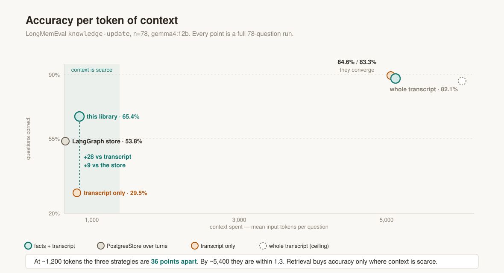
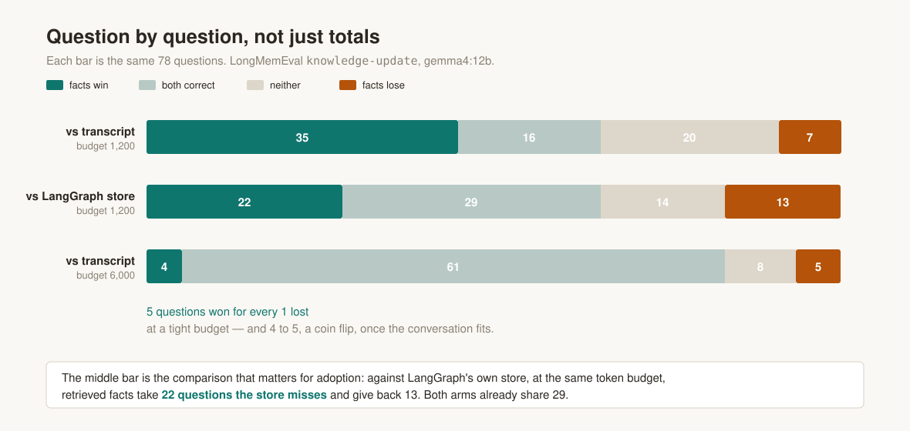
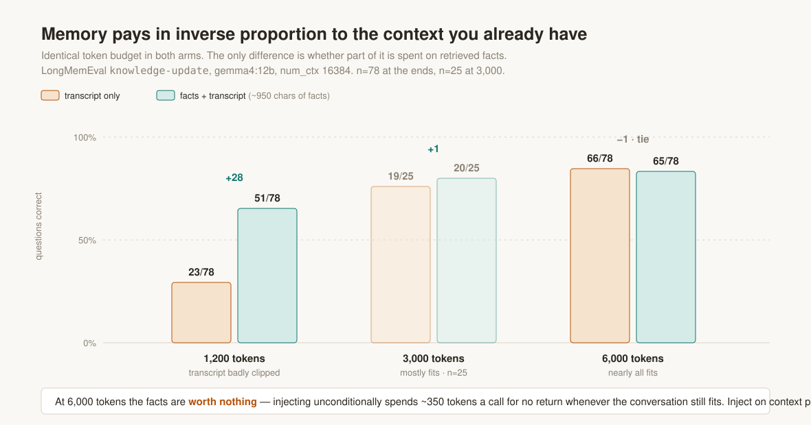

# Building a Fact-Driven Memory Layer for LangGraph

Part 1 in a series. At a matched context budget, a typed fact graph scores 51/78 against LangGraph's `PostgresStore` at 42/78 on LongMemEval — 22 questions won, 13 lost. The advantage decays to zero by a 6,000-token budget, and the reason it decays is the more useful result.

LangGraph ships `PostgresStore` with pgvector, and LangMem on top of it: save a memory, cosine-search it back. For short sessions that is fine. It seemed to me that cosine similarity over saved documents was leaving something on the table — a store has no way to say *this value replaced that one*, or *this claim came from that sub-agent* — so I built the alternative to find out: a typed fact graph on Postgres, per-claim capture, `supersedes` edges, forked sub-agent namespaces.

Getting it working was the easy part. Working out whether it was actually better took considerably longer, and the answer is more conditional than I expected.

Code and every run: [github.com/masterkidan/langgraph-beads-memory](https://github.com/masterkidan/langgraph-beads-memory).

## The benchmark mistake

LongMemEval `knowledge-update`, 78 questions, gemma4:12b, external and MIT-licensed. Each arm retrieving what it would naturally retrieve:

| arm | correct | mean input tokens |
|---|---|---|
| whole transcript in the prompt | 64/78 (82%) | 6,337 |
| LangGraph `PostgresStore` over turns | 57/78 (73%) | 2,473 |
| fact graph | 48/78 (62%) | 328 |

The fact graph places third of four — and takes **7.5× less context** than the store it lost to. That table does not compare memory strategies, it compares budgets. An arm handed 2,473 tokens beats an arm handed 328 whatever fills them.

I nearly published that table. It is also the default shape of most memory benchmarks: each system retrieves "its natural amount," whichever retrieves more wins on accuracy, and the cost difference lands in a separate table or none at all. It reads as fair because both sides are doing retrieval.

A harness that answers the intended question holds total context constant and varies only how it is spent:

- **transcript only** — fill the budget with the most recent conversation
- **facts + transcript** — spend ~950 characters on retrieved facts, fill the remainder with transcript

The second arm is the production shape. A memory layer does not replace the conversation; `BeadsMemoryMiddleware` sends the windowed raw messages plus an injected block. Sweeping the budget then isolates the allocation decision.

## Results

*Fig 1 — Every arm as a point on (context spent, accuracy), n=78 per point. At ~1,200 tokens the three strategies are 36 points apart. By ~5,400 they sit within 1.3 points of each other and of the ceiling.*

At a 1,200-token budget:

| at 1,200 tokens, n=78 | correct | % of ceiling | % of context |
|---|---|---|---|
| transcript only | 23/78 | 36% | 19% |
| LangGraph `PostgresStore` | 42/78 | 66% | 15% |
| **fact graph** | **51/78** | **80%** | 19% |

Four-fifths of what full attention achieves, on a fifth of the context. Clipping the window to a fifth costs 64% of the ceiling with raw transcript and 20% with the fact graph on top.

Totals hide whether two arms solve the *same* questions:

*Fig 2 — The same 78 questions as win / both / neither / lose. Against the store at a matched budget: 22 won, 13 lost, 29 already shared.*

## The advantage decays to zero

*Fig 3 — Identical token budget in both arms; only the split changes. n=78 at the ends, n=25 at 3,000.*

| budget | transcript only | facts + transcript | Δ |
|---|---|---|---|
| 1,200 tokens | 23/78 | **51/78** | **+28** |
| 3,000 tokens | 19/25 | 20/25 | +1 |
| 6,000 tokens | 66/78 | 65/78 | −1 |

Five questions won for every one lost at a tight budget. At 6,000 tokens the split is 4 to 5 — a coin flip — with 61 of 78 already shared.

Sample size matters at this end of the curve, and I got this wrong once. At n=25 the 6,000 point measures −2, which looks like interference — facts displacing transcript that held the answer. At n=78 it is −1 with a 4-to-5 split, which is a tie. Memory stops paying; it does not cost accuracy.

## Why the decay happens

A model does not search its context. It attends to all of it, at every layer: each token emits a query vector, every prior token carries a key, the dot products pass through a softmax, and the output is a weighted blend of everything present. Dozens of heads do this in parallel and compose the result across depth.

`search()` makes one decision — embed the query, rank by cosine, take the top 8, commit — before the model has reasoned about anything.

Retrieval is a function of the context, so by the data processing inequality it cannot increase mutual information with the answer. Filtering can only lose. When the material fits in the window, an external retriever is strictly worse than passing everything through, and only the margin is in question. That is the convergence in Fig 1.

Retrieval holds exactly one advantage, decisive where it applies: attention cannot attend to tokens that were never admitted. Truncation is the one thing it cannot route around. The job of a memory layer is not to retrieve better than attention — it is to decide what enters the window so attention has the right material.

That predicts something testable. A correctly built memory layer should be **invisible** on any benchmark where the content fits, and decisive where it does not. It also explains why so many memory benchmarks show nothing: they run in the regime where memory should show nothing.

## What made the difference

**Deriving `supersedes` links rather than requesting them.** The agent had `remember_fact`, the held facts with their short ids in the prompt, and an explicit instruction to link contradictions. It proposed a link on **9 of 78** questions that were *all* about a value changing. Deriving the same links from a normalised value comparison found **43**. The model was not refusing — retrieval had never shown it the fact to supersede, which sat at rank 21 of ~180 while the top 8 were captured assistant prose.

**Resolution instead of retirement.** Excluding a superseded fact leaves the slot empty, which does not help an agent about to answer with the stale value. A hit on any version of a claim now resolves to the current one. The failure this fixes: answering "you currently have three bikes" when the user owns four.

**A `derived_from` filter.** Every captured conclusion links to the facts that were in context when it was written, so a restatement is dropped when the fact it came from is already in the block. Recorded provenance, not redundancy inferred from a vector.

**Tool results captured into the calling agent's namespace.** A sub-agent reads a TLS handshake p99 of 41ms and drops it when summarising. That figure passes 9 of 56 runs on the incident scenario, and no ranking change reaches it, because it was never written. Scoping capture to the caller keeps raw sub-agent reads out of the root's ranking — 44 child facts to 27 root in a live run.

## Practical notes

Mostly things I would want to know before building another one.

- Context budgets have to match across arms, or the benchmark measures budgets
- Cost and accuracy belong in the same row; separated, a cheaper-and-slightly-worse arm reads as a loss
- Pairwise win/lose belongs alongside totals — two arms can tie while solving different questions
- A retrieval-only gate is worth having. Scoring "does the gold answer reach the injected block" needs no generation and runs in minutes, so ranking changes are evaluable without a full run
- `num_ctx` has to be set explicitly. Ollama defaults to 2048 and truncates silently: prompts of 5k, 22k and 135k tokens all report `prompt_eval_count=2051`, so token accounting goes wrong with no error
- Graph structure is better derived from values and provenance than requested from the model
- Structural changes that look obviously correct still need measuring. A supersedes-demotion rule produced byte-identical answers across all 78 questions

## What's next

Everything above runs on a ~6,900-token haystack, so scarcity was produced by capping the budget rather than by lengthening the conversation. That simulates a small-context model, not a long session.

Part 2 runs LongMemEval_S — ~115k tokens across 40 sessions, where full context is not an option and most of the haystack is distractors. The prediction, stated before the run: the curve holds and the advantage grows, because the fraction of the conversation that fits keeps falling. What would falsify it: the advantage shrinking with session length, which would mean the effect here was an artefact of clipping a short transcript.

A stronger possibility is worth separating. On a haystack that is mostly noise, filtering could beat full context outright by removing distractors that steal attention mass, rather than merely surviving truncation. No measurement here supports that, and none has tested it.

Part 3 covers pressure-gated injection: inject nothing while the conversation fits, inject as it stops fitting. That is what Fig 3 implies, and what the implementation does not yet do — which is the honest state of a side project that set out to build a better store and ended up mostly learning when a store is worth having at all.
